```{r, include = FALSE}
knitr::opts_chunk$set(
  collapse = TRUE,
  comment = "#>"
)
```

```{r setup}
library(reportifyr)

options("venv_dir" = file.path(here::here(), "vignettes"))
initialize_report_project(file.path(here::here(), "vignettes"))
```

```{r, include = FALSE, echo=FALSE, message=FALSE, warning=FALSE, output=FALSE}
library(ggplot2)
library(dplyr)

result <- file.copy(from = system.file("extdata/template.docx", package = "reportifyr"),
                    to = file.path(here::here(), "vignettes", "report", "shell", "template.docx"))

data <- Theoph
p <- ggplot(data, aes(x = Time, y = conc, group = Subject)) +
  geom_point() + 
  geom_line() +
  theme_bw() +
  labs(x = "Time (hr)", y = "Theophylline concentration (mg/L)")

meta_types = get_meta_type(file.path(here::here(), "vignettes", "report", "standard_footnotes.yaml"))

figures_path <- file.path(here::here(), "vignettes", "OUTPUTS", "figures")
meta_plot_file_name <- "theoph-pk-plot.png"

ggsave_with_metadata(
  filename = file.path(figures_path, meta_plot_file_name), 
  meta_type = meta_types$`conc-time-trajectories`,
  width = 6,
  height = 3
)

calc_auc_linear_log <- function(time, conc) {
  auc <- 0
  
  cmax_index <- which.max(conc)
  
  for (i in 1:(length(time) - 1)) {
    delta_t <- time[i + 1] - time[i]
    
    if (i < cmax_index) {
      
      auc <- auc + delta_t * (conc[i + 1] + conc[i]) / 2
    } else if (i >= cmax_index && conc[i + 1] > 0 && conc[i] > 0) {
      
      auc <- auc + delta_t * (conc[i] - conc[i + 1]) / log(conc[i] / conc[i + 1])
    } else {
      
      auc <- auc + delta_t * (conc[i + 1] + conc[i]) / 2
    }
  }
  
  return(auc)
}

pk_params <- data %>%
  mutate(Subject = as.numeric(Subject)) %>% 
  group_by(Subject) %>%
  summarise(
    cmax = max(conc, na.rm = TRUE), 
    tmax = Time[which.max(conc)], 
    auc = calc_auc_linear_log(Time, conc),
    wt = Wt %>% unique()
  )

lr <- pk_params %>% 
  ggplot(aes(x = wt, y = auc)) +
  geom_point() +
  geom_smooth(method = "lm", formula = y ~ x, se = TRUE, color = "blue") +
  theme_bw() +
  labs(x = "Subject weight (kg)", y = "AUC (hr mg/L)")

plot_file_name <- "theoph-pk-exposure.png"
ggsave_with_metadata(
  filename = file.path(figures_path, plot_file_name),
  meta_type = meta_types$`linear-regression-plot`,
  plot = lr,
  width = 6,
  height = 3
)

tables_path <- file.path(here::here(), "vignettes", "OUTPUTS", "tables")
outfile_name <- "theoph-pk-parameters.csv"

write_csv_with_metadata(
  pk_params, 
  file = file.path(tables_path, outfile_name),
  row.names = FALSE
)

data_outfile_name <- "theoph-pk-data.RDS"
save_rds_with_metadata(data, file = file.path(tables_path, data_outfile_name))
```

There are certain situations where footnotes might not be desired on all figures/tables
or even out throughout the entire document. reportifyr supports this behavior 
through arguments to `build_report`. First, we'll build a report that lacks
footnotes throughout the entire document. To do this we can set the `add_footnotes`
argument to `FALSE` instead of the default `TRUE`.

```{r}
# Specify input and output .docx files
docx_shell <- file.path(here::here(), "vignettes", "report", "shell", "template.docx")
docx_out <- file.path(here::here(), "vignettes", "report", "draft", "draft.docx")

# Specify paths to tables and figures directories and the standard_footnotes.yaml
tables_path <- file.path(here::here(), "vignettes", "OUTPUTS", "tables")
figures_path <- file.path(here::here(), "vignettes", "OUTPUTS", "figures")
footnotes <- file.path(here::here(), "vignettes", "report", "standard_footnotes.yaml")

build_report(docx_in = docx_shell, 
             docx_out = docx_out,
             figures_path = figures_path,
             tables_path = tables_path,
             standard_footnotes_yaml = footnotes,
             add_footnotes = FALSE)
```

This produces a report without footnotes in the entire document.
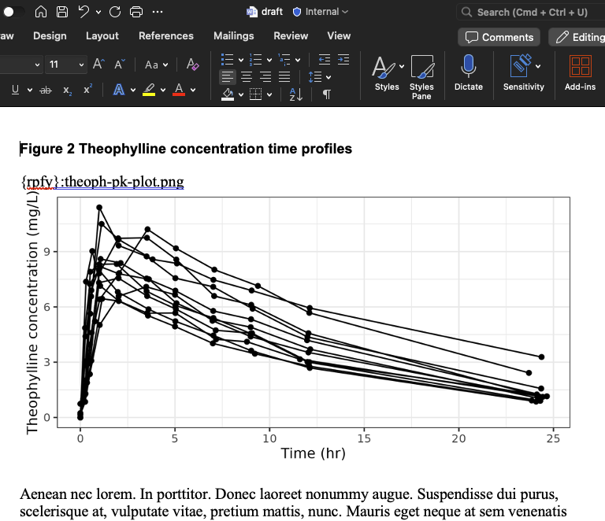{width=100%}
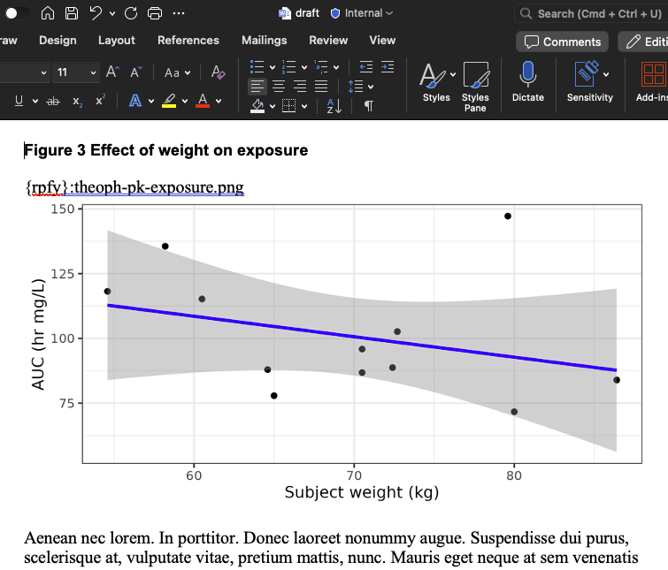{width=100%}
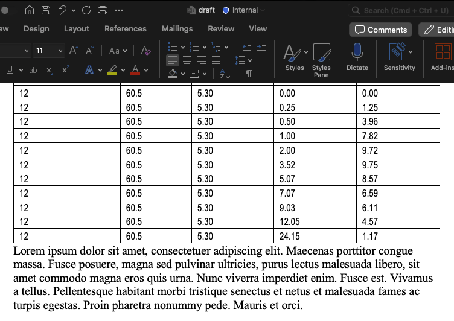{width=100%}
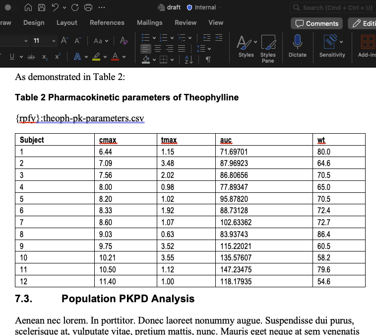{width=100%}

If we instead want to include an appendix figure and table without footnotes, 
but want footnotes within the rest of the report we can use the 
`footnotes_fail_on_missing_metadata` argument to achieve this. Because footnotes
are stored in the metadata a figure/table with no metadata would usually throw 
an error, with `footnotes_fail_on_missing_metadata = FALSE` we instead get a 
warning in the log messages and the figures/tables footnote addition is skipped.
One caveat to this is that table formatting is stored in the metadata - 
`table1_format` is an additional argument to the `format_flextable` function that
converts RDS/csv data into flextables for addition to the word document. The 
table that you don't want footnotes for won't have a metadata file. We've handled
this by using default formatting for csv files and if the table is saved as a 
flextable in an RDS file we do not alter the formatting. If the RDS file is not
a flextable we `format_flextable` with default arguments.

```{r}
library(ggplot2)
library(dplyr)
set.seed(123)

n <- 300
DV <- runif(n, min = 5, max = 100)
IPRED <- pmax(0, DV + rnorm(n, mean = 0, sd = 40 / sqrt(DV)))


gof_plot <- ggplot(data = data.frame(IPRED, DV), aes(x = DV, y = IPRED)) +
  geom_point(color = "blue", alpha = 0.6) +
  geom_abline(slope = 1, intercept = 0, color = "red", linetype = "dashed") +
  labs(
    title = "Goodness-of-Fit Plot",
    x = "Observed Data (DV)",
    y = "Individual Predictions (IPRED)"
  ) +
  theme_minimal()

gof_fig_name <- "theoph-pk-gof.png" 
ggsave(filename = file.path(here::here(), "vignettes", "OUTPUTS", "figures", gof_fig_name), 
       plot = gof_plot,
       width = 6,
       height = 4.5)

subjects <- 15
pk_demo <- data.frame(
  ID = sprintf("S%03d", 1:subjects),
  Age = sample(18:80, subjects, replace = TRUE),
  Sex = sample(c("M", "F"), subjects, replace = TRUE),
  Weight = round(rnorm(subjects, mean = 70, sd = 15), 1),      
  Height = round(rnorm(subjects, mean = 170, sd = 10), 1),     
  BMI = round(rnorm(subjects, mean = 25, sd = 4), 1),           
  Smoking_Status = sample(c("Non-smoker", "Smoker", "Ex-smoker"), subjects, replace = TRUE),
  Renal_Function = sample(c("Normal", "Mild impairment", "Moderate impairment", "Severe impairment"), subjects, replace = TRUE),
  Hepatic_Function = sample(c("Normal", "Mild impairment", "Severe impairment"), subjects, replace = TRUE)
)

table_file <- "theoph-pk-demographics.csv"
utils::write.csv(pk_demo, 
                 file = file.path(here::here(), "vignettes", "OUTPUTS", "tables", table_file),
                 row.names = FALSE)
```

We will now use the template-ef.docx file which contains a figure and table in the
appendicies that we wish to not have footnotes. These files were generated without
metadata and could be non reportifyr generated content. 
```{r}
result <- file.copy(from = system.file("extdata/template-ef.docx", package = "reportifyr"),
                    to = file.path(here::here(), "vignettes", "report", "shell", "template-ef.docx"))
```

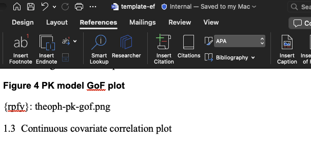{width=100%}
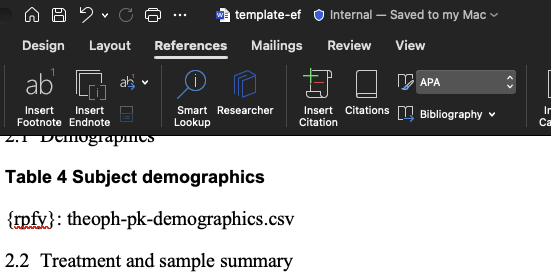{width=100%}


```{r}
# Specify input and output .docx files
docx_shell <- file.path(here::here(), "vignettes", "report", "shell", "template-ef.docx")
docx_out <- file.path(here::here(), "vignettes", "report", "draft", "draft-ef.docx")

# Specify paths to tables and figures directories and the standard_footnotes.yaml
tables_path <- file.path(here::here(), "vignettes", "OUTPUTS", "tables")
figures_path <- file.path(here::here(), "vignettes", "OUTPUTS", "figures")
footnotes <- file.path(here::here(), "vignettes", "report", "standard_footnotes.yaml")

build_report(docx_in = docx_shell, 
             docx_out = docx_out,
             figures_path = figures_path,
             tables_path = tables_path,
             standard_footnotes_yaml = footnotes,
             add_footnotes = TRUE,
             footnotes_fail_on_missing_metadata = FALSE
             )
```

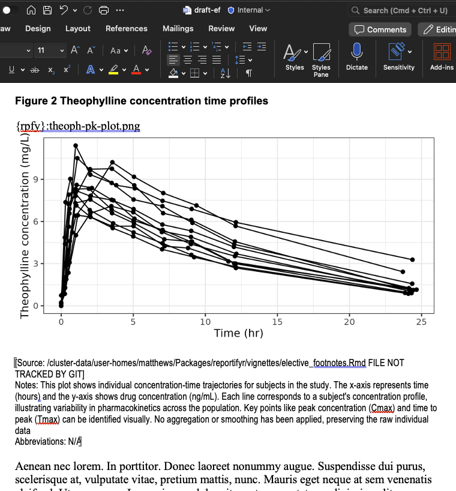{width=100%}
{width=100%}
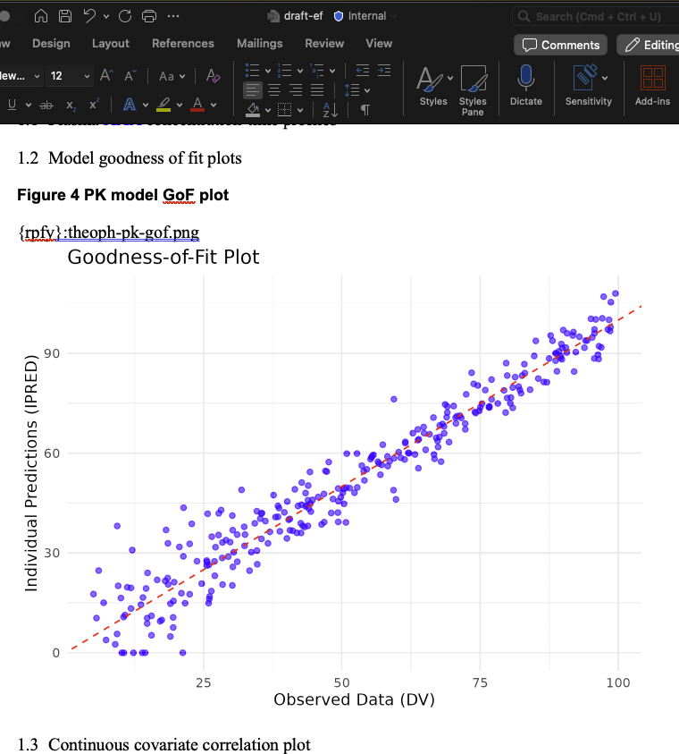{width=100%}
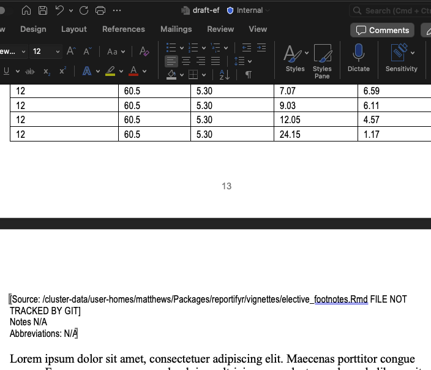{width=100%}
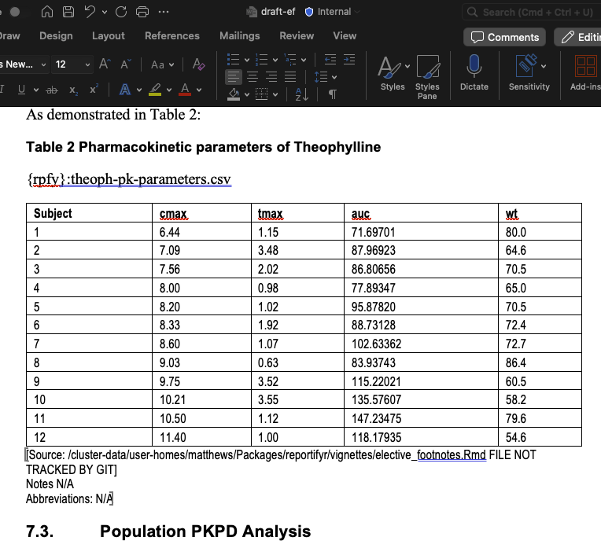{width=100%}
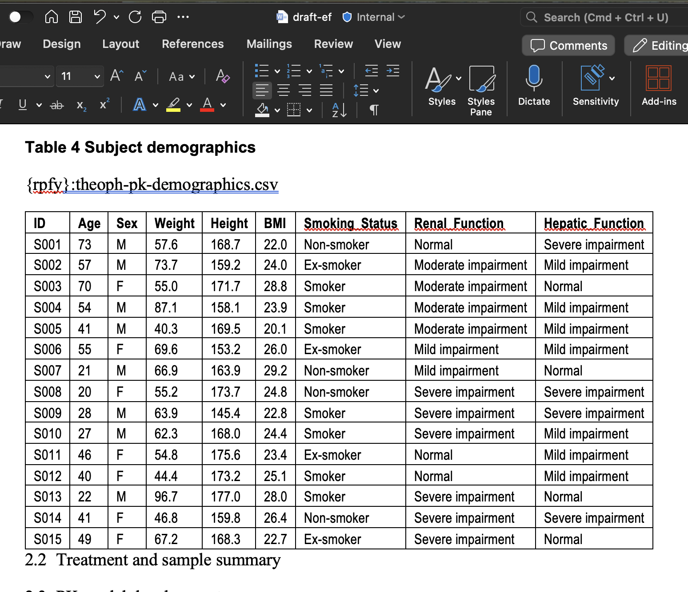{width=100%}

We can see in the logs that theoph-pk-demographics.csv was missing metadata and 
that default formatting was applied. We additionally see warnings about missing 
metadata files.

Additionally, the source path in the footnote points to the R script or quarto 
document used to create that table or figure. If you would like the path to the
object itself you can set the `include_object_path` argument to `TRUE` to get an 
additional footnote with object path.

```{r}
# Specify input and output .docx files
docx_shell <- file.path(here::here(), "vignettes", "report", "shell", "template-ef.docx")
docx_out <- file.path(here::here(), "vignettes", "report", "draft", "draft-ef-op.docx")

# Specify paths to tables and figures directories and the standard_footnotes.yaml
tables_path <- file.path(here::here(), "vignettes", "OUTPUTS", "tables")
figures_path <- file.path(here::here(), "vignettes", "OUTPUTS", "figures")
footnotes <- file.path(here::here(), "vignettes", "report", "standard_footnotes.yaml")

build_report(docx_in = docx_shell, 
             docx_out = docx_out,
             figures_path = figures_path,
             tables_path = tables_path,
             standard_footnotes_yaml = footnotes,
             add_footnotes = TRUE,
             footnotes_fail_on_missing_metadata = FALSE,
             include_object_path = TRUE
             )
```

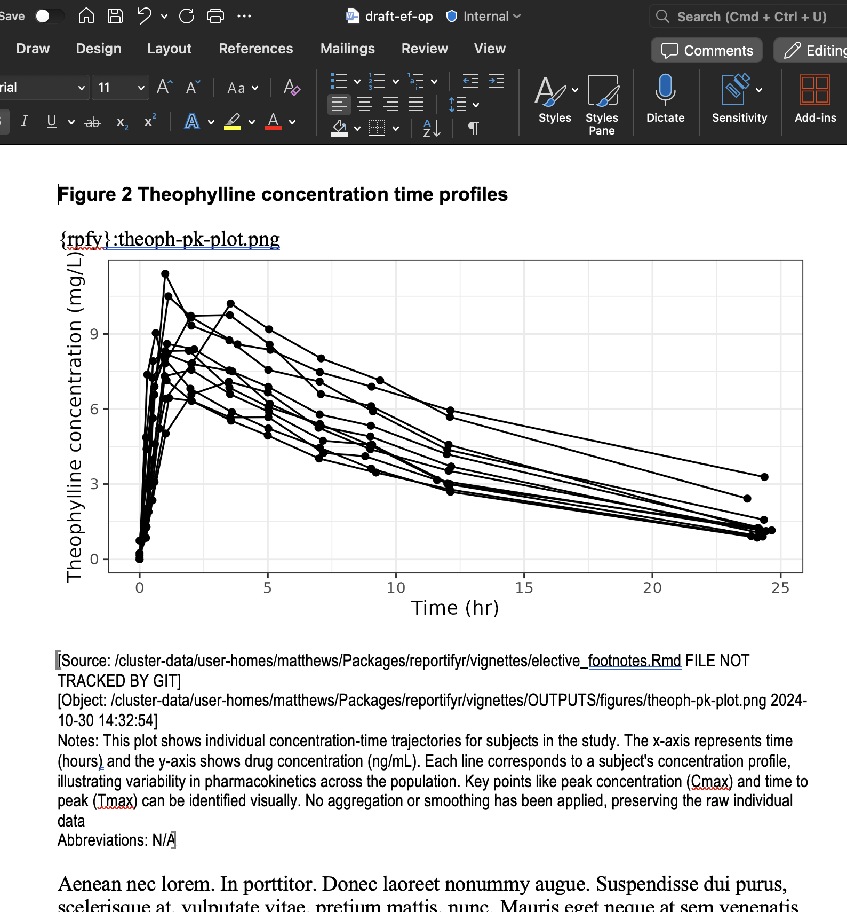{width=100%}
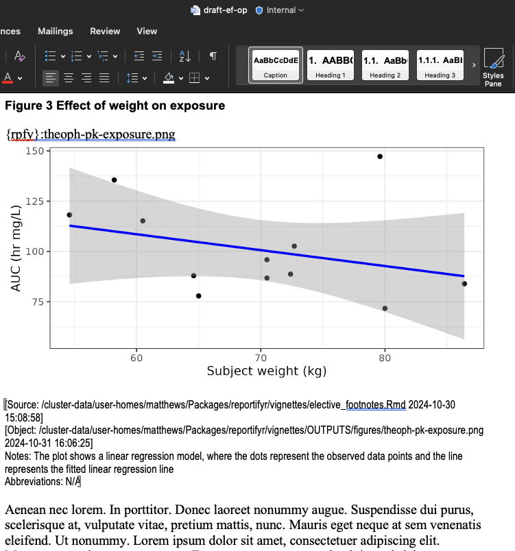{width=100%}
{width=100%}
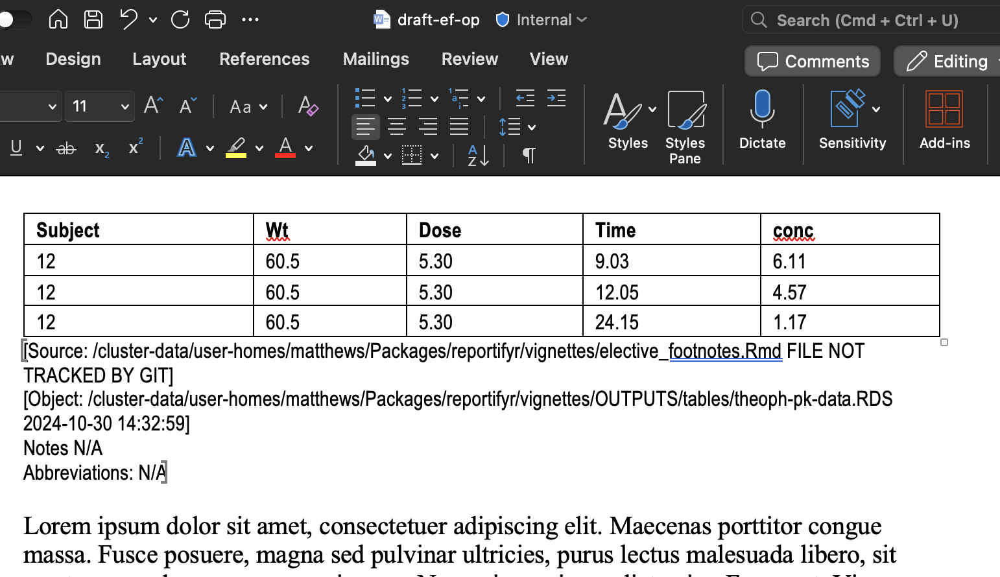{width=100%}
{width=100%}
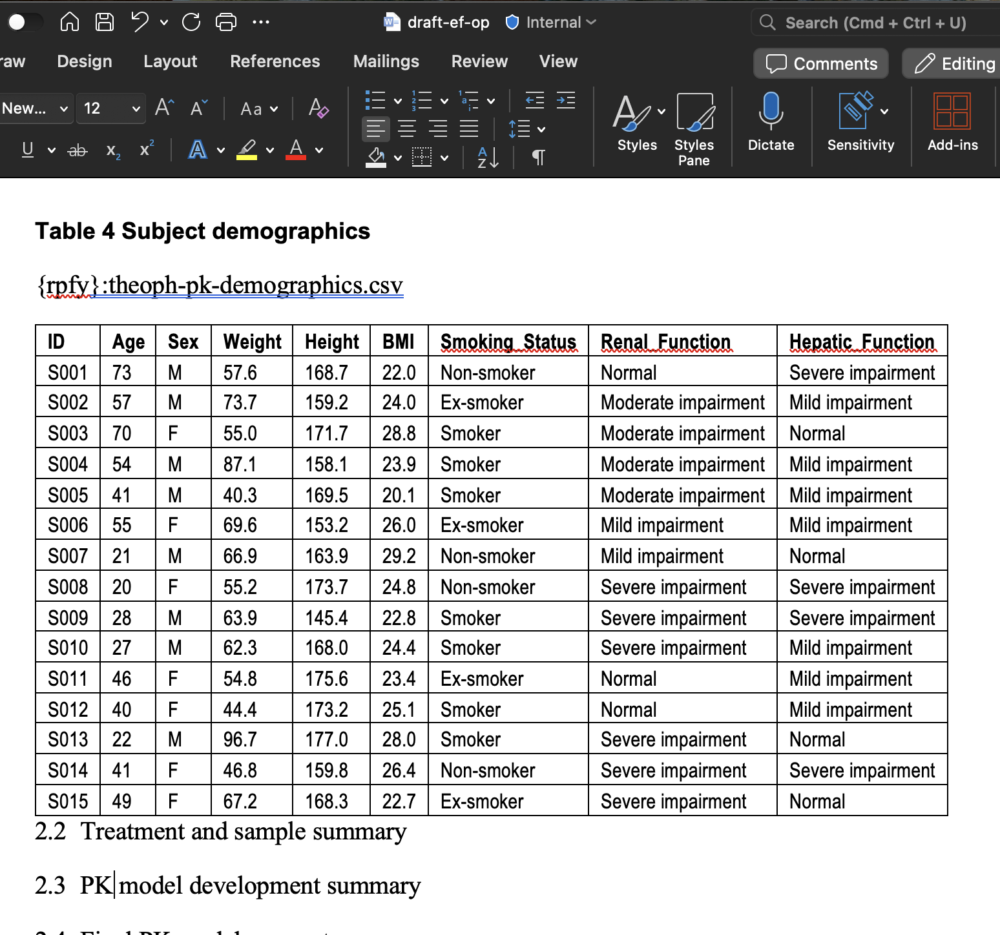{width=100%}


```{r remove directories, include = FALSE}
unlink(file.path(here::here(), "vignettes", ".venv"), recursive = TRUE)
unlink(file.path(here::here(), "vignettes", "OUTPUTS"), recursive = TRUE)
unlink(file.path(here::here(), "vignettes", "report"), recursive = TRUE)
unlink(file.path(here::here(), "vignettes", "logfile.log"))
```
