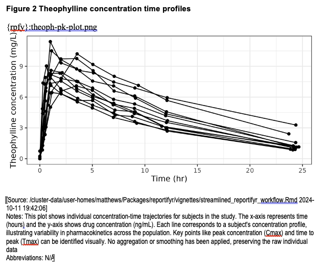

```{r, include = FALSE}
knitr::opts_chunk$set(
  collapse = TRUE,
  comment = "#>"
)
```

```{r setup}
library(reportifyr)

options("venv_dir" = file.path(here::here(), "vignettes"))
initialize_report_project(file.path(here::here(), "vignettes"))
```

```{r, include = FALSE, echo=FALSE, message=FALSE, warning=FALSE, output=FALSE}
library(ggplot2)
library(dplyr)

result <- file.copy(from = system.file("extdata/template.docx", package = "reportifyr"),
                    to = file.path(here::here(), "vignettes", "report", "shell", "template.docx"))

data <- Theoph
p <- ggplot(data, aes(x = Time, y = conc, group = Subject)) +
  geom_point() + 
  geom_line() +
  theme_bw() +
  labs(x = "Time (hr)", y = "Theophylline concentration (mg/L)")

meta_types = get_meta_type(file.path(here::here(), "vignettes", "report", "standard_footnotes.yaml"))

figures_path <- file.path(here::here(), "vignettes", "OUTPUTS", "figures")
meta_plot_file_name <- "theoph-pk-plot.png"

ggsave_with_metadata(
  filename = file.path(figures_path, meta_plot_file_name), 
  meta_type = meta_types$`conc-time-trajectories`,
  width = 6,
  height = 3
)

calc_auc_linear_log <- function(time, conc) {
  auc <- 0
  
  cmax_index <- which.max(conc)
  
  for (i in 1:(length(time) - 1)) {
    delta_t <- time[i + 1] - time[i]
    
    if (i < cmax_index) {
      
      auc <- auc + delta_t * (conc[i + 1] + conc[i]) / 2
    } else if (i >= cmax_index && conc[i + 1] > 0 && conc[i] > 0) {
      
      auc <- auc + delta_t * (conc[i] - conc[i + 1]) / log(conc[i] / conc[i + 1])
    } else {
      
      auc <- auc + delta_t * (conc[i + 1] + conc[i]) / 2
    }
  }
  
  return(auc)
}

pk_params <- data %>%
  mutate(Subject = as.numeric(Subject)) %>% 
  group_by(Subject) %>%
  summarise(
    cmax = max(conc, na.rm = TRUE), 
    tmax = Time[which.max(conc)], 
    auc = calc_auc_linear_log(Time, conc),
    wt = Wt %>% unique()
  )

lr <- pk_params %>% 
  ggplot(aes(x = wt, y = auc)) +
  geom_point() +
  geom_smooth(method = "lm", formula = y ~ x, se = TRUE, color = "blue") +
  theme_bw() +
  labs(x = "Subject weight (kg)", y = "AUC (hr mg/L)")

plot_file_name <- "theoph-pk-exposure.png"
ggsave_with_metadata(
  filename = file.path(figures_path, plot_file_name),
  meta_type = meta_types$`linear-regression-plot`,
  plot = lr,
  width = 6,
  height = 3
)

tables_path <- file.path(here::here(), "vignettes", "OUTPUTS", "tables")
outfile_name <- "theoph-pk-parameters.csv"

write_csv_with_metadata(
  pk_params, 
  file = file.path(tables_path, outfile_name),
  row.names = FALSE
)

data_outfile_name <- "theoph-pk-data.RDS"
save_rds_with_metadata(data, file = file.path(tables_path, data_outfile_name))
```

`reportifyr` also offers some wrapper functions to streamline and ease report 
generation and report updating. Instead of adding bookmarks, tables, plots, and
footnotes in a step-wise process, you can call `build_report` to perform all of 
those actions. Additionally, if your document already contains figures and tables 
inserted via `reportifyr`, this wrapper function will remove those objects before 
updating to prevent duplication.

```{r, build report}
# Specify input and output .docx files
docx_shell <- file.path(here::here(), "vignettes", "report", "shell", "template.docx")
docx_out <- file.path(here::here(), "vignettes", "report", "draft", "draft.docx")

# Specify paths to tables and figures directories and the standard_footnotes.yaml
tables_path <- file.path(here::here(), "vignettes", "OUTPUTS", "tables")
figures_path <- file.path(here::here(), "vignettes", "OUTPUTS", "figures")
footnotes <- file.path(here::here(), "vignettes", "report", "standard_footnotes.yaml")

build_report(docx_in = docx_shell, 
             docx_out = docx_out,
             figures_path = figures_path,
             tables_path = tables_path,
             standard_footnotes_yaml = footnotes)
```

This produces the same `reportifyr` draft as does the step-wise process, but with 
only a single function call.



And we can remove the magic strings and bookmarks with the same `finalize_document` 
function:

```{r}
docx_final <- file.path(here::here(), "vignettes", "report", "final", "report.docx")
finalize_document(docx_in = docx_out, docx_out = docx_final)
```

The magic strings and bookmarks are removed and all links between the document and `reportifyr`
are severed. 

```{r remove directories, include = FALSE}
unlink(file.path(here::here(), "vignettes", ".venv"), recursive = TRUE)
unlink(file.path(here::here(), "vignettes", "OUTPUTS"), recursive = TRUE)
unlink(file.path(here::here(), "vignettes", "report"), recursive = TRUE)
unlink(file.path(here::here(), "vignettes", "logfile.log"))
```
